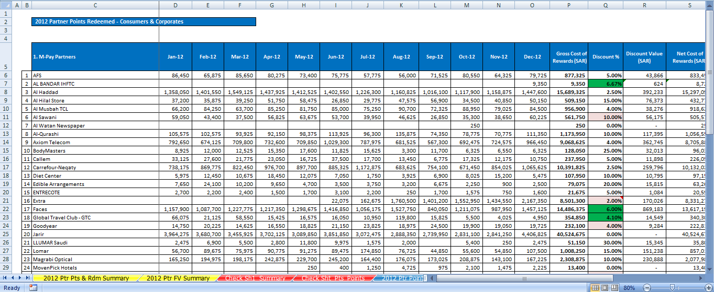
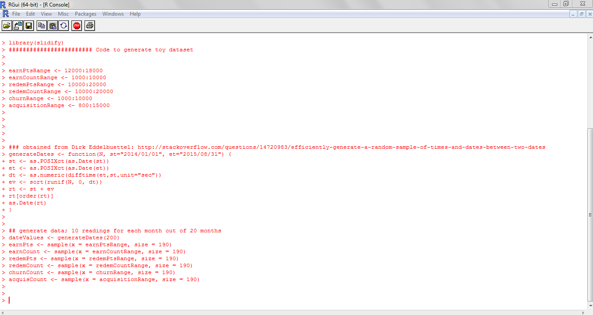

## Tools

---

## Tools

Tools determine

> - What can be done 
> - How can it be done
> - By When can it be done

--- &twocol w1:56% w2:44% 

## Tools - Considerations

*** {name: left}
- Over-used
- Under-used
- Incorrect use

*** {name: right}

 

--- .quote .nobackground

<q>Are we over-utilising, under-utilising, or incorrectly using tool(s)?</q>

--- .quote .nobackground .dark

<q>R</q>

---

## A Data Analyst's workflow

---

## A Data Analyst's workflow

--- .quote .nobackground

<q>Reproducibility...</q>

---
## Reproducibility - Why is it Important?

> - Quality Checking
> - Utilisable when Disseminating knowledge
> - Dynamic/Reactive Documents

---
## Reproducibility

--- &twocol w1:56% w2:44% 
## Reproducibility

*** {name: left}
> - Differing intra/inter-sheet Organisation
> - Difficult to Replicate
> - Difficult to check Quality
> - Difficult for a new-comer to follow

*** {name: right}

---
## Reproducibility - The R way

>- Command history available

---
## Reproducibility - The R way

- Command history available
	- Enables documentation of all steps

---
## Reproducibility - The R way

- Command history available
	- Enables documentation of all steps
	- Quality Checks can be included in script

---
## Reproducibility - The R way

- Command history available
	- Enables documentation of all steps
	- Quality Checks can be included in script
	- Comments to elaborate on the logic of script

---
## Reproducibility - The R way

- KnitR and RMarkdown

---
## Reproducibility - The R way

- KnitR and RMarkdown
	- A single document containing analyses, script, and results

---
## Reproducibility - The R way

- KnitR and RMarkdown
	- A single document containing analyses, script, and results
	- Preserves contextual narrative for any analyses

---
## Reproducibility - The R way

- KnitR and RMarkdown
	- A single document containing analyses, script, and results
	- Preserves contextual narrative for any analyses
	- Document adjusts to any changes in data/script automatically

---
## Reproducibility - The R way

- KnitR and RMarkdown
	- A single document containing analyses, script, and results
	- Preserves contextual narrative for any analyses
	- Document adjusts to any changes in data/script automatically
	- Output: HTML, PDF, Tufte-style and LateX style documents, Word

---
## Reproducibility - The R way

- KnitR and RMarkdown
	- Showcase examples from local folder
	- [Probability: The Analysis of Data Vol. 1](http://www.amazon.com/Probability-Analysis-Data-Guy-Lebanon/dp/1479344761/)
	- [The Statistical Sleuth 2nd Edition](http://www3.amherst.edu/~nhorton/sleuth/)

--- .quote .nobackground

<q>Visualisation...</q>

---
## Visualisation

- Typically: Excel
- Tableau

--- &twocol w1:50% w2:50% 
## Visualisation

*** {name: left}
### In Excel...
> - Inflexible
> - Difficult to Automate
> - Time-consuming and Inefficient
> - Basic Graphs are not Ideal

*** {name: right}
### In R...
> - Very Flexible
> - Easily Automated
> - Efficient with large data sets
> - Charting package - ggplot2 - is based on [Grammar of Graphics](http://byrneslab.net/classes/biol607/readings/wickham_layered-grammar.pdf)
> - Greater Charting capability
> - Interactivity

--- &twocol w1:50% w2:50% 
## Visualisation

*** {name: left}
### In Excel...

*** {name: right}
### In R...

---
## Visualisation

- Dashboard Demo

--- .nobackground .dark .quote

<q>Thank you</q>
